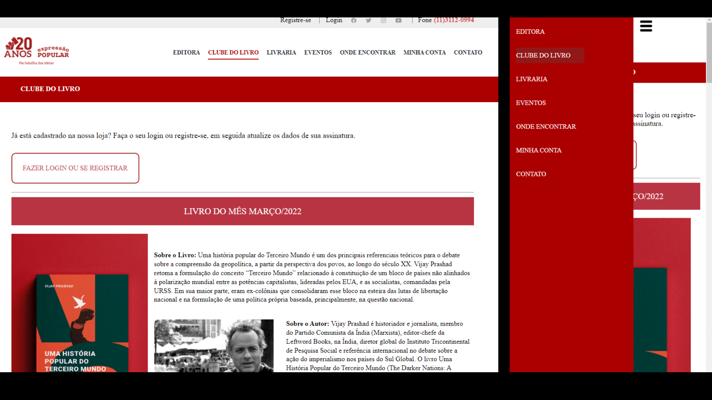

# Livraria 📕✏

 
Repliquei uma landing page de uma editora. 😝
  

<dl>
  <dt>Obs :
  <dd>
  
 **Este projeto é uma versão fictícia. Os links não funcionam** ‼
  
  </dd>
  </dt>

 

## Aprendizados 📝
 

* Manipulando fontes, cores e dimensões para aumentar semelhanças com a página profissional.
* Criando menu para mobile com Jquery.
* Posicionando elementos de forma responsiva com flex box.
* Alterando estilos de elementos ao passar mouse por cima.

 

## Acesso ⬇⬇
 

> [Link para a página aqui](https://projeto-livraria.vercel.app/)

 

## Contato ✉

>Para dúvidas, críticas ou sugestões, me envie um [Email](mailto:brunoornelio@hotmail.com)
